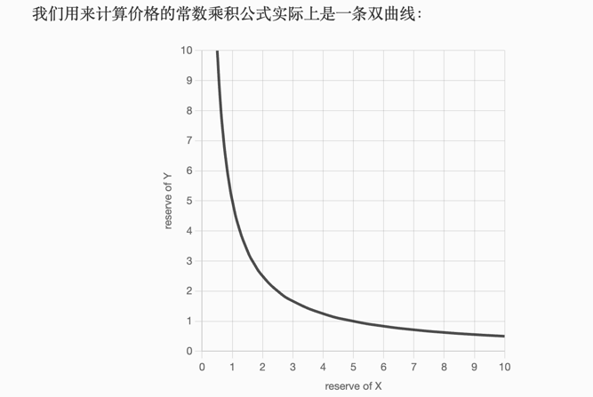

#### Uniswap版本

- 截至2021年6月，Uniswap已推出三个版本。
    - 第一个版本于 2018 年 11 月推出，仅允许以太币和代币之间的兑换。链式兑换也可以实现代币与代币之间的兑换。
    - V2 于 2020 年 3 月推出，它是 V1 的巨大改进，允许任何 ERC20 代币之间直接交换，以及任何对之间的链式交换。
    - V3 于 2021 年 5 月推出，它显著提高了资本效率，这使得流动性提供者可以从池中移除更大一部分流动性，同时仍然获得相同的回报（或者将资本压缩到较小的价格范围内并获得高达
      4000 倍的利润）。

#### 什么是 Uniswap？

- 简单来说，Uniswap是一个去中心化交易所 (DEX)，旨在成为中心化交易所的替代品。它在以太坊区块链上运行，完全自动化：没有管理员、经理或具有特权访问权限的用户。
- 底层是一种算法，可以创建池子，或者代币对，并向其中填充流动性，让用户利用这些流动性来交换代币。这种算法被称为自动做市商或自动流动性提供者。
- 让我们进一步了解做市商。
- 做市商是向市场提供流动性（交易资产）的实体。流动性使交易成为可能：如果你想卖出某样东西但没人买，就不会有交易。有些交易对流动性很高（例如
  BTC-USDT），但有些交易对流动性很低甚至没有流动性（例如一些骗局或可疑的山寨币）。
- DEX 必须拥有足够（或大量）的流动性才能正常运作，并成为中心化交易所的替代品。获得这种流动性的一种方法是让 DEX
  的开发者将自己的钱（或投资者的钱）投入其中，成为做市商。然而，这不是一个现实的解决方案，因为考虑到 DEX
  允许任何代币之间的兑换，他们需要大量资金来为所有货币对提供足够的流动性。此外，这会使 DEX 中心化：作为唯一的做市商，开发者将拥有很大的权力。
- 更好的解决方案是允许任何人成为做市商，这就是 Uniswap 成为自动化做市商的原因：任何用户都可以将他们的资金存入交易对（并从中受益）。
- Uniswap 扮演的另一个重要角色是价格预言机。价格预言机是一种从中心化交易所获取代币价格并将其提供给智能合约的服务——这种价格通常很难操纵，因为中心化交易所的交易量通常非常大。然而，虽然交易量没有那么大，但
  Uniswap 仍然可以充当价格预言机。
- Uniswap 充当二级市场，吸引套利者，他们利用 Uniswap 和中心化交易所之间的价格差异获利。这使得 Uniswap
  池中的价格尽可能接近大型交易所的价格。如果没有适当的定价和储备平衡功能，这是不可能的。

#### 恒定乘积做市商

- 您可能已经听说过这个定义，让我们看看它的含义。
- 自动化做市商是一个通用术语，涵盖了不同的去中心化做市商算法。最受欢迎的算法（以及催生该术语的算法）与预测市场有关 -
  允许通过预测获利的市场。Uniswap 和其他链上交易所是这些算法的延续。
- Uniswap 的核心是恒定乘积函数：
    - ``` x∗y=k ```
- x是 Ether 储备，y是代币储备（反之亦然），k是一个常数。当你用以太币换取代币时，你会将以太币存入合约并获得一定数量的代币作为回报。Uniswap
  确保每次交易后k保持不变（事实并非如此，我们稍后会看到原因）。

``` 
演变为 ：
(x+Δx)(y−Δy)=xy 
Δx是我们交易的以太币或代币的数量，Δy是我们交换获得的代币或以太币的数量
有了这个公式，我们现在可以找到Δy
[uniswap.md](uniswap.md)

```
- 
- 双曲线永不相交X或者Y，因此任何储备都不会为 0。这使得储备无限！


